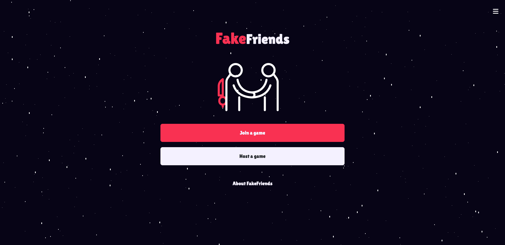
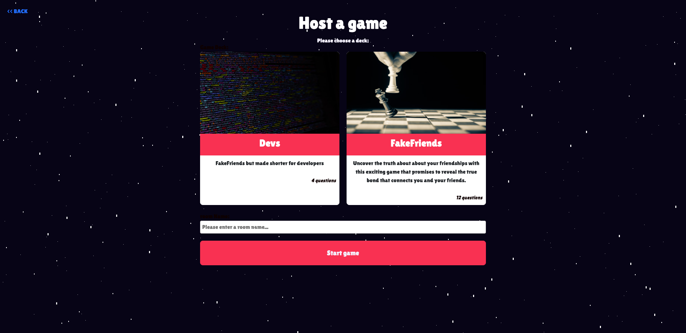
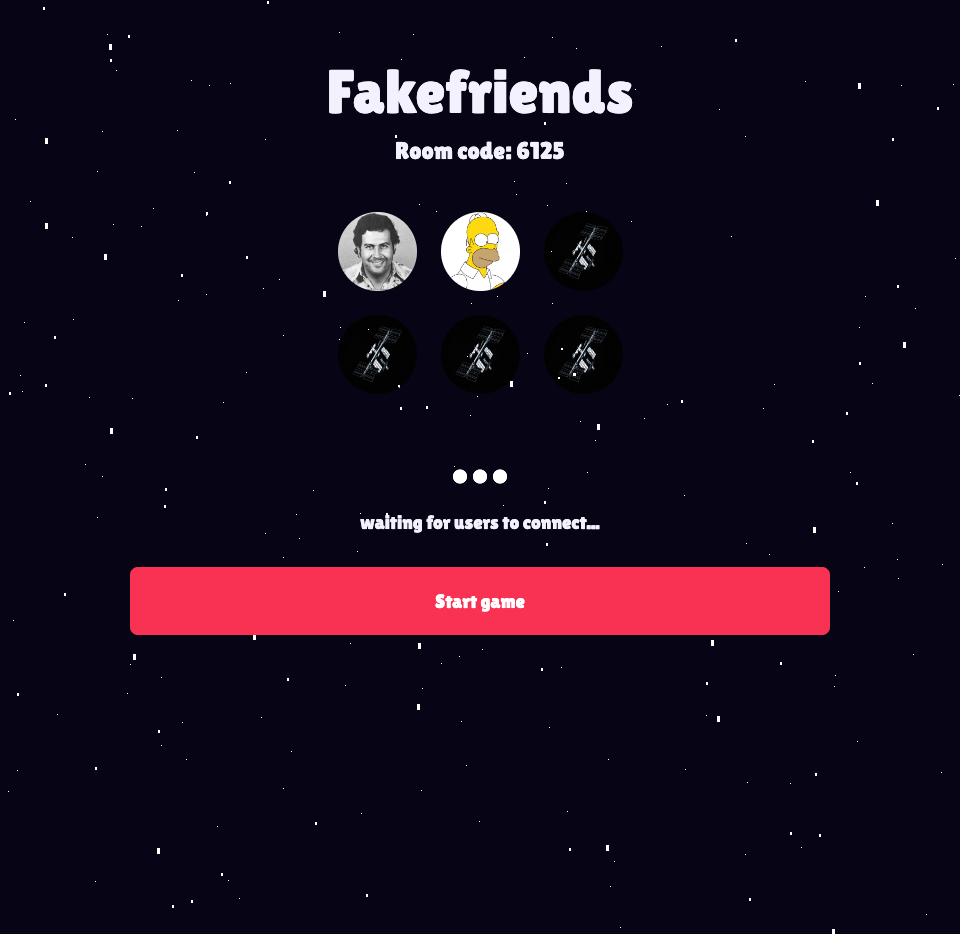
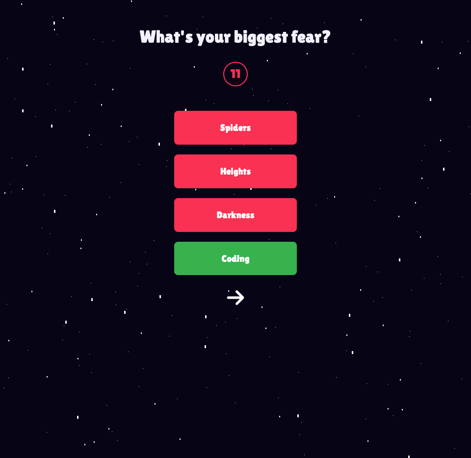
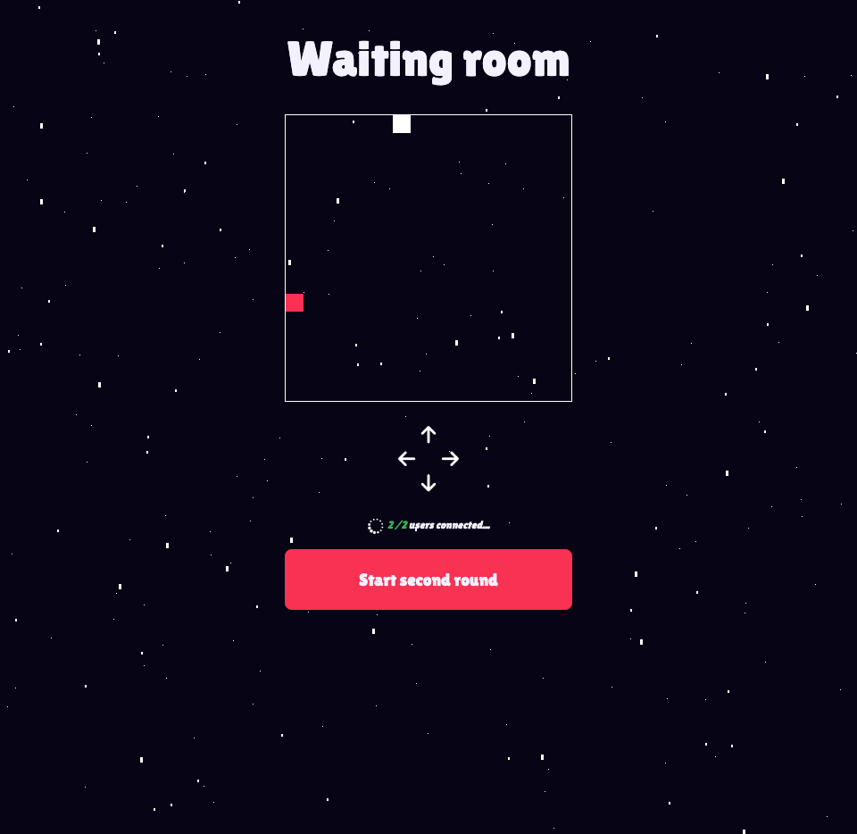
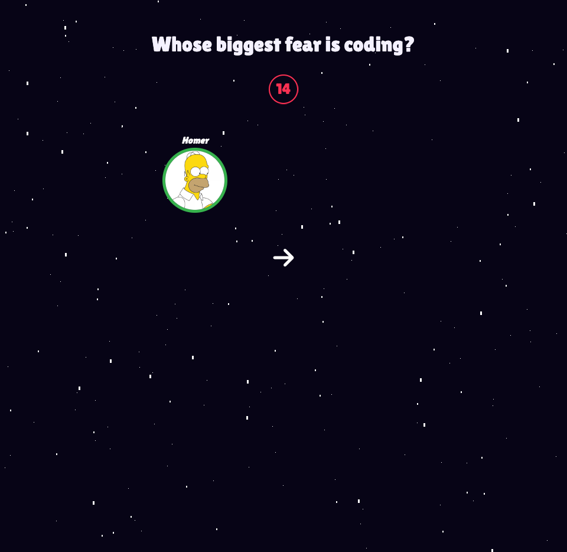
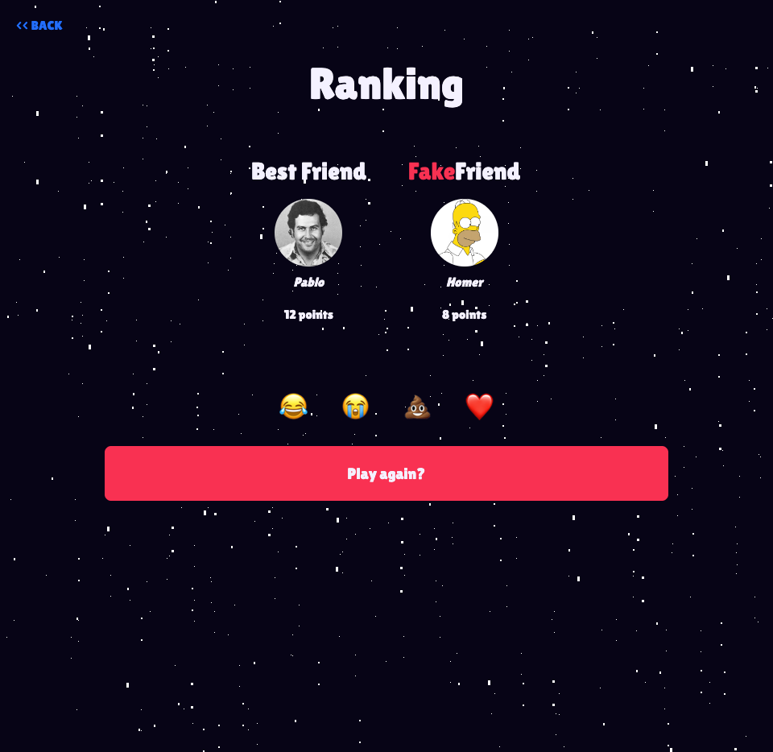
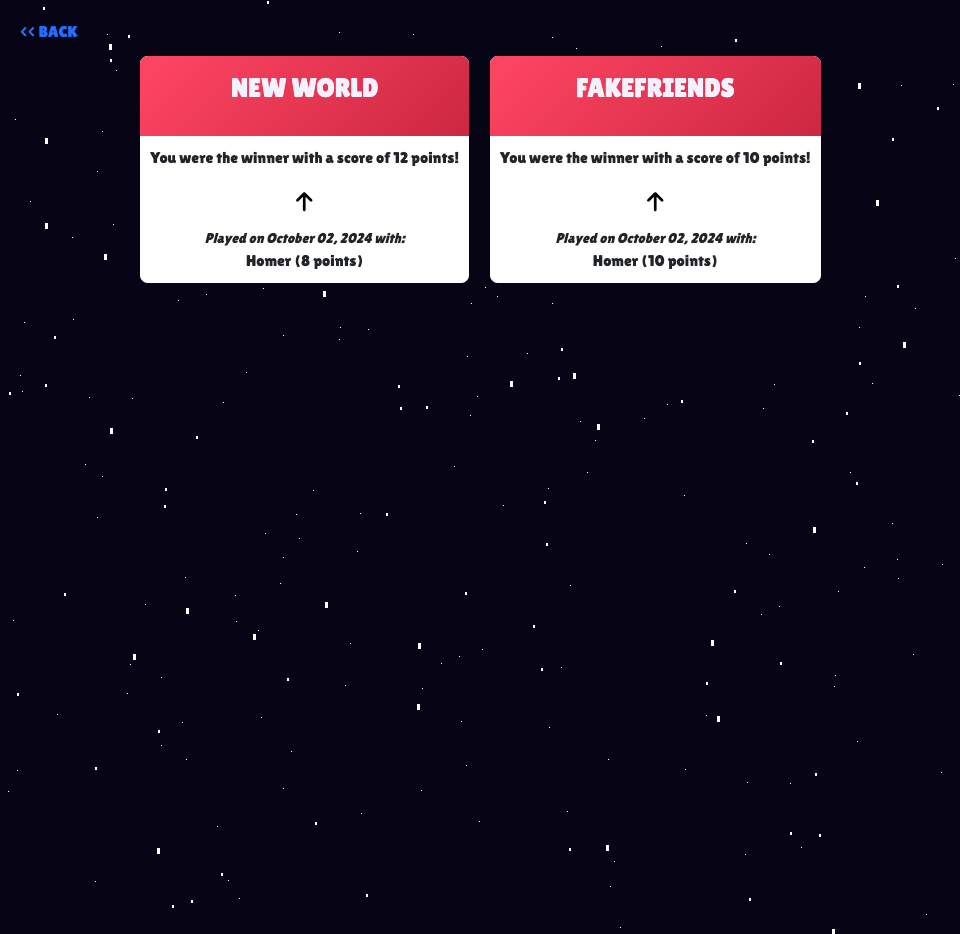

# FakeFriends — Discover who are your real friends!

**Demo Version**: [https://fakefriends.onrender.com/](https://fakefriends.onrender.com/)

FakeFriends is a full-stack web application originally developed during Le Wagon Berlin's batch 1141 Bootcamp. It was collaboratively created by Felix Cramer, Florian Miller, and myself. After the Bootcamp, I took over the project to add new features and enhance the gameplay experience, bringing to life many of the ideas we initially envisioned but couldn’t implement due to time constraints. This is my vision of how the project should be.

## Technologies Used

- **Ruby on Rails**: Backend framework for managing the game logic and user data.
- **PostgreSQL**: Database for efficient data management and storage.
- **Devise**: User authentication and account management.
- **Redis & Action Cable**: Enables real-time communication for chatrooms and game states via websockets.
- **Cloudinary**: For secure and scalable image storage.
- **HTML & SASS**: Frontend structure and styling.
- **Animate.css**: Smooth animations across the game, enhancing user experience.
- **Stimulus.js**: JavaScript framework for managing frontend behavior, including game mechanics and dynamic elements.

## Features

- **Room Creation & Access via Code**: Users can create rooms with unique codes that can be shared with friends. Up to six players can join each room and interact in a waiting room before the game starts.
- **Real-Time Waiting Rooms**: Players can see who’s connected and view their profile pictures in a dynamic room powered by websockets through Redis.
- **First Round - Questionnaire**: Players answer a set of 4 to 12 questions about themselves. This round helps set up the main gameplay while allowing real-time interactions in the waiting room.
- **In-Game Chat & Snake Mini-Game**: While waiting for others to finish their questionnaires, players can engage in a chatroom and play the popular Snake game.
- **Second Round - Guess Your Friend**: Players attempt to guess which friend gave which answer in a fun and creative way. The players themselves are the possible answers!
- **Real-Time Multiplayer Experience**: Every action during the game, including round transitions, is managed through websockets, allowing for real-time updates for all participants.
- **Endgame & Winner Display**: At the end of the game, the player who knows the most about their friends is crowned the winner. The game also humorously identifies a "FakeFriend" based on the responses.
- **Interactive Emoji Reactions**: In the final room, players can send real-time reactions such as hearts or laughter to keep the atmosphere fun and light.

## Challenges & Complexity

This project presented significant challenges in both backend and frontend development. The game’s real-time functionality, powered by Redis and websockets, required advanced understanding of server-client interactions. The animations and UI elements were meticulously designed using Stimulus.js and Animate.css to ensure a smooth and enjoyable user experience. Additionally, the database architecture is well-orchestrated to handle complex game logic, including player data, real-time interactions, and multiple game states.

## Screenshots

  

    
  

  

    
  

  

    
  

  

    
  

  

    
  

  

    
  

  

    
  

  

    
  

